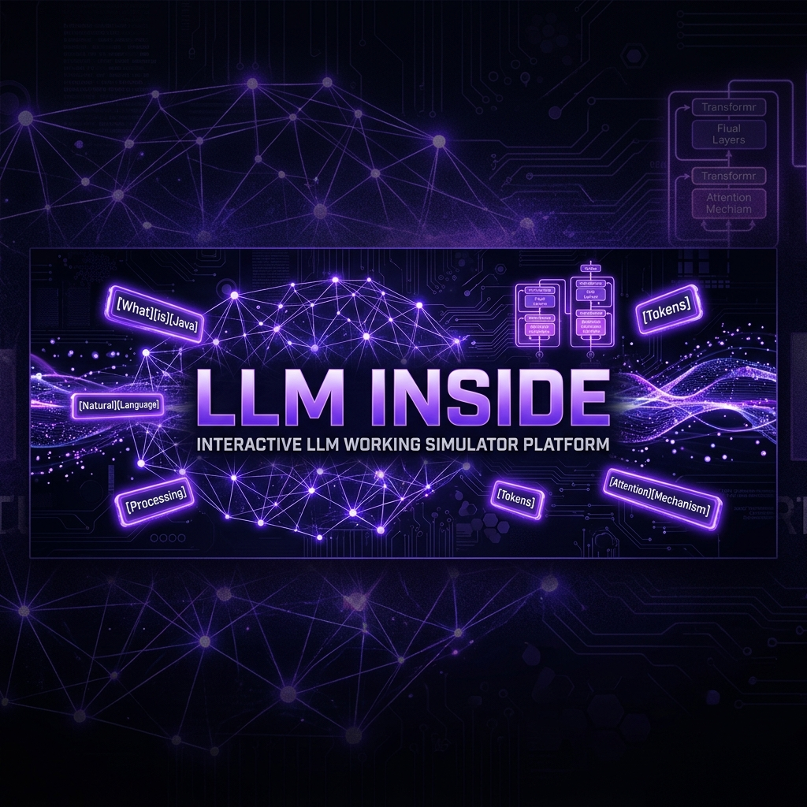
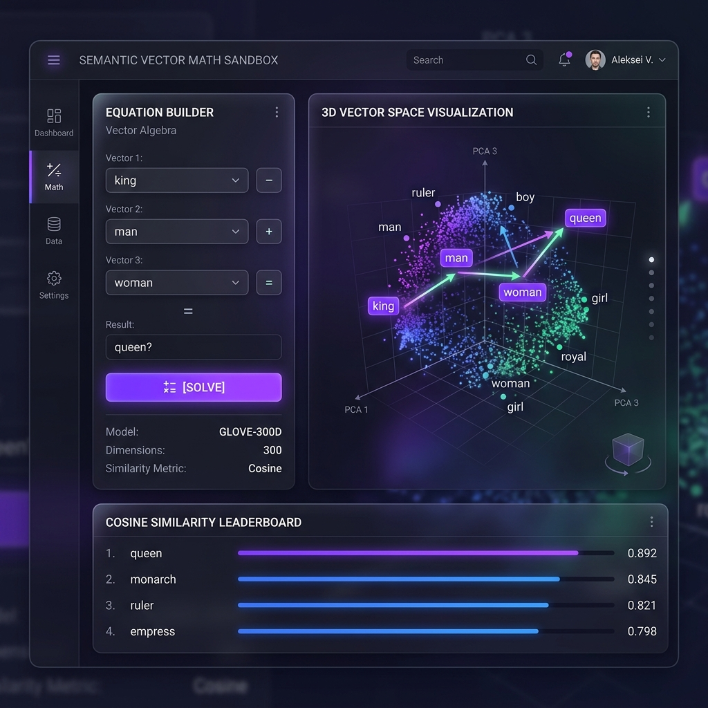
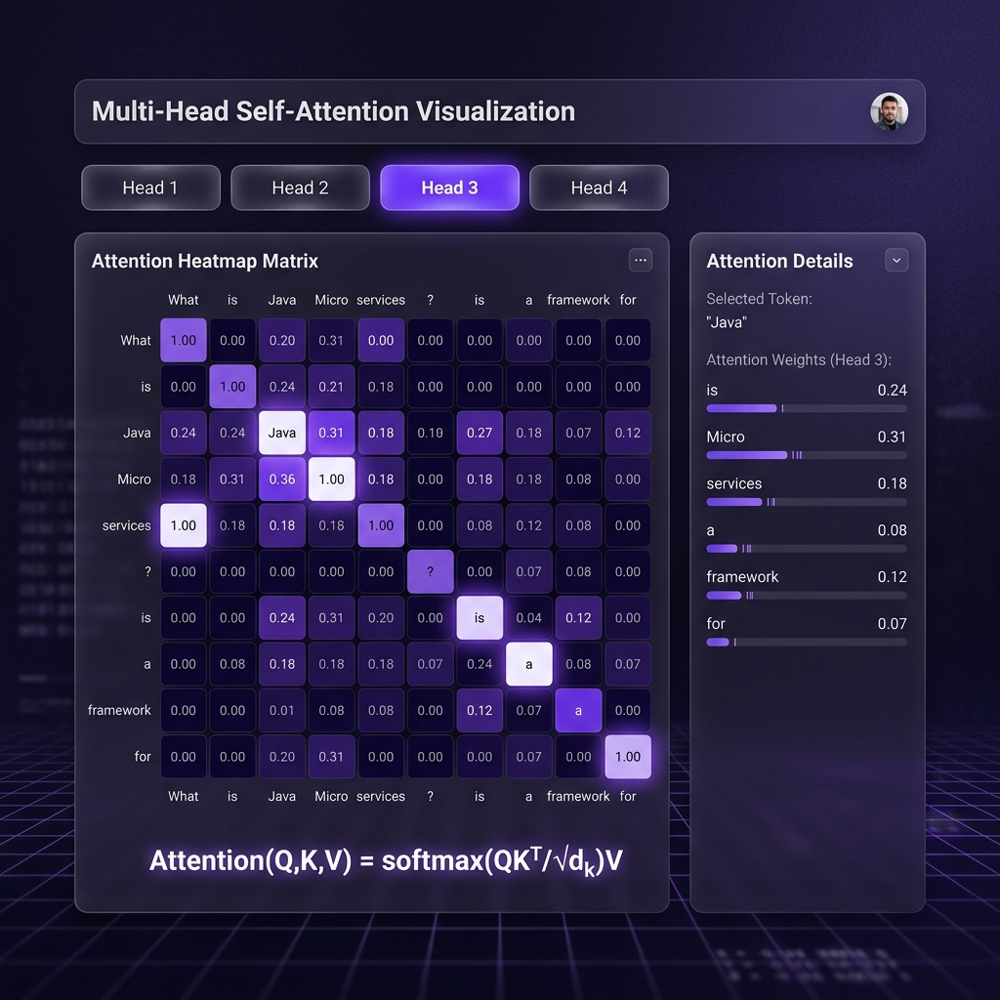
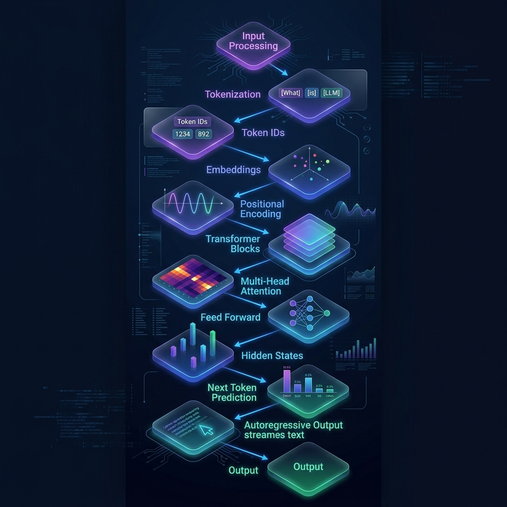
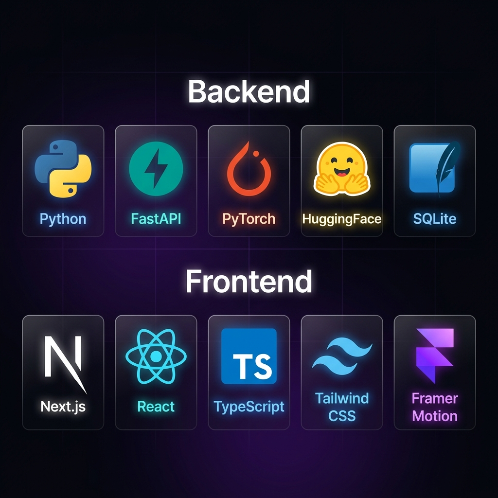

<div align="center">



<br/>


<br/><br/>

> **An interactive educational platform that visually simulates how Large Language Models process text — stage by stage, in real time.**

</div>

---

## 📚 Table of Contents

- [Overview](#-overview)
- [Live Feature Previews](#-live-feature-previews)
- [Processing Pipeline](#-processing-pipeline)
- [Tech Stack](#-tech-stack)
- [Project Structure](#-project-structure)
- [Installation & Setup](#-installation--setup)
- [Usage](#-usage)
- [Contributing](#-contributing)
- [Author](#-author)
- [License](#-license)

---

## 🧠 Overview

**LLM INSIDE** demystifies the inner workings of transformer-based language models. Feed any text prompt and watch it travel through every processing stage — from raw characters to probability distributions and final generated output — with scientific equations, attention heatmaps, and interactive visualizations at each step.

Whether you are a **student**, **researcher**, or **engineer**, this platform turns abstract NLP theory into an explorable, hands-on experience.

---

## 🖼️ Live Feature Previews

### 🔢 Semantic Vector Math Sandbox
> Perform arithmetic on word embeddings — `King − Man + Woman = Queen` — and watch the algebra play out in interactive 3D space.



---

### 🧩 Multi-Head Self-Attention Heatmap
> Explore how different attention heads route information between tokens. Hover any cell to inspect exact attention weights.



---

## 🔬 Processing Pipeline

Every prompt passes through 12 scientifically-grounded stages before output is generated.

<div align="center">



</div>

| Stage | Name | Description |
|:---:|---|---|
| **1** | Input Processing | Raw text ingestion and character/word analysis |
| **2** | Cleaning & Normalization | Unicode normalisation, lowercase folding |
| **3** | Tokenization | BPE / WordPiece / SentencePiece subword splitting |
| **4** | Token IDs | Vocabulary integer mapping (GPT-2: 50,257 tokens) |
| **5** | Embeddings | Dense vector projection into `d_model`-dimensional space |
| **6** | Positional Encoding | Sinusoidal waves / RoPE injecting sequence order |
| **7** | Transformer Blocks | N stacked layers with residual skip connections |
| **8** | Multi-Head Attention | Scaled dot-product attention: `softmax(QKᵀ/√dₖ)V` |
| **9** | Feed-Forward Network | GELU-activated 4× expansion and compression |
| **10** | Hidden States | Final contextualized vector representations |
| **11** | Next Token Prediction | Softmax probability distribution over vocabulary |
| **12** | Autoregressive Output | Token-by-token generation loop |

---

## 🛠️ Tech Stack



### Backend
| Technology | Version | Role |
|---|---|---|
| **Python** | 3.12 | Runtime |
| **FastAPI** | 0.111 | REST API + WebSocket server |
| **Uvicorn** | Latest | ASGI server |
| **PyTorch** | CPU | LLM inference engine |
| **HuggingFace Transformers** | Latest | `distilgpt2` / `gpt2` model loading |
| **SQLAlchemy** | 2.x | ORM |
| **SQLite** | Built-in | Default database |

### Frontend
| Technology | Version | Role |
|---|---|---|
| **Next.js** | 14 | React framework (App Router) |
| **React** | 18 | UI library |
| **TypeScript** | 5 | Type-safe code |
| **Tailwind CSS** | 3 | Utility-first styling |
| **Framer Motion** | Latest | Animations & transitions |
| **HTML Canvas** | — | Rotatable 3D PCA vector projections |

---

## 📁 Project Structure

```
LLM-Working-Simulator-Platform/
├── backend/
│   ├── app/
│   │   ├── main.py               # FastAPI entry point + WebSocket
│   │   ├── database.py           # SQLAlchemy engine & session
│   │   ├── models/               # ORM models (user, session, analytics)
│   │   ├── routers/              # API route handlers
│   │   │   ├── auth.py
│   │   │   ├── simulation.py     # /simulate/run, /vector-math, /export
│   │   │   ├── models.py
│   │   │   └── analytics.py
│   │   └── services/
│   │       ├── llm_service.py    # LLM inference + vector algebra engine
│   │       ├── auth_service.py
│   │       └── export_service.py
│   └── requirements.txt
├── frontend/
│   ├── src/
│   │   ├── app/
│   │   │   ├── page.tsx           # Login / Landing
│   │   │   ├── pipeline/          # 12-stage simulator
│   │   │   ├── vector-math/       # Semantic Vector Math Sandbox ✨
│   │   │   ├── experiment/        # A/B parameter comparison lab
│   │   │   ├── compare/           # Model architecture comparer
│   │   │   ├── education/         # Interactive quiz
│   │   │   ├── analytics/         # Session analytics dashboard
│   │   │   └── admin/             # Admin panel
│   │   ├── components/
│   │   │   ├── Navbar.tsx
│   │   │   └── stages/
│   │   │       └── StageVisualizers.tsx
│   │   ├── contexts/AuthContext.tsx
│   │   └── hooks/useSimulation.ts
│   └── package.json
├── docs/
│   ├── hero_banner.png
│   ├── pipeline_diagram.png
│   ├── vector_math_preview.png
│   ├── attention_heatmap.png
│   ├── tech_stack.png
│   ├── architectural_models.md
│   └── trading_models.md
├── composer.json
├── run_platform.bat              # One-click Windows launcher
├── .gitignore
├── LICENSE
└── README.md
```

---

## 🚀 Installation & Setup

### Prerequisites

- **Node.js** v18+
- **Python** 3.10+
- **Git**

### ⚡ Quick Start (Windows)

Double-click **`run_platform.bat`** in the project root — it automatically starts the FastAPI backend and Next.js frontend concurrently.

### Manual Setup

#### 1. Clone

```bash
git clone https://github.com/vijaymahes9080/LLM-Working-Simulator-Platform.git
cd LLM-Working-Simulator-Platform
```

#### 2. Backend

```bash
cd backend
python -m venv .venv
.venv\Scripts\activate        # Windows
# source .venv/bin/activate   # macOS / Linux
pip install -r requirements.txt
python -m uvicorn app.main:app --reload --port 8000
```

- API: `http://localhost:8000`
- Swagger docs: `http://localhost:8000/docs`

#### 3. Frontend

```bash
cd frontend
npm install
npm run dev
```

- App: `http://localhost:3000`

---

## 🌐 Deployment & Hosting Guide

LLM INSIDE is built as a decouple architecture (Next.js frontend + FastAPI backend). Here is how you can host the full project for free on the cloud.

### 1. Host the Backend (FastAPI) on Render / Railway
Render and Railway connect directly to GitHub and build Python applications natively.

1. **Sign Up**: Go to [Render](https://render.com) or [Railway](https://railway.app).
2. **New Service**: Select **Web Service** and connect this GitHub repository.
3. **Configure Service**:
   - **Root Directory**: `backend`
   - **Build Command**: `pip install -r requirements.txt`
   - **Start Command**: `python -m uvicorn app.main:app --host 0.0.0.0 --port $PORT`
4. **Environment Variables**:
   - `DATABASE_URL` (optional): If using a external PostgreSQL database. Otherwise, Render will write a local SQLite `llm_inside.db` file (use Render Disk to make it persistent).
5. **URL**: Copy the resulting deployment URL (e.g. `https://llm-inside-backend.onrender.com`).

### 2. Host the Frontend (Next.js) on Vercel
Vercel is the creator of Next.js and hosts it out-of-the-box with high performance.

1. **Sign Up**: Go to [Vercel](https://vercel.com).
2. **Import Project**: Select **New Project** and import this repository.
3. **Configure Project**:
   - **Root Directory**: `frontend`
   - **Framework Preset**: Next.js
4. **Add Environment Variables**:
   - Add `NEXT_PUBLIC_API_URL` = Your backend URL (e.g. `https://llm-inside-backend.onrender.com`)
   - Add `NEXT_PUBLIC_WS_URL` = Your backend WebSocket URL (change `https` to `wss`, e.g. `wss://llm-inside-backend.onrender.com`)
5. **Deploy**: Click **Deploy**. Vercel will build the project and provide a public URL!

### 3. Host the Frontend on GitHub Pages (Free, Zero Sign-up Required)
The repository includes a pre-configured **GitHub Actions** workflow (`.github/workflows/deploy.yml`) that automatically builds the Next.js static site and publishes it to GitHub Pages on every push to `main`.

**One-time setup (takes 30 seconds):**
1. In your GitHub repository, go to **Settings → Pages**.
2. Under **Source**, select **GitHub Actions**.
3. *(Optional)* To connect a live backend, go to **Settings → Secrets and variables → Actions** and add:
   - `NEXT_PUBLIC_API_URL` = `https://your-backend.onrender.com`
   - `NEXT_PUBLIC_WS_URL` = `wss://your-backend.onrender.com`
4. Push any change to `main` (or click **Actions → Run workflow**) to trigger the first deploy.

**Your live site URL will be:**
```
https://vijaymahes9080.github.io/LLM-Working-Simulator-Platform/
```

> **Note:** GitHub Pages only hosts the **static frontend**. The FastAPI backend must still be deployed separately (e.g. Render/Railway) using the guide above.

---

## 🎮 Usage

| Feature | URL | Description |
|---|---|---|
| 🏠 Login | `/` | Register / Login / Guest mode |
| 🔬 Simulator | `/pipeline` | 12-stage live LLM simulation |
| 🧮 Vector Math | `/vector-math` | Semantic embedding algebra sandbox |
| 🧪 Experiments | `/experiment` | A/B parameter comparison lab |
| 🤖 Compare | `/compare` | Model architecture side-by-side diff |
| 🎓 Learn | `/education` | Interactive transformer equations quiz |
| 📊 Analytics | `/analytics` | Session history and token metrics |

---

## ✨ Key Features

- 📡 **Real-time WebSocket** streaming — see each pipeline stage animate as it runs
- 🔢 **Vector Math Sandbox** — `King − Man + Woman = Queen` with 3D PCA canvas
- 🧩 **Attention Heatmaps** — per-head interactive matrices with hover inspection
- 🌐 **3D Embedding Projector** — drag-rotatable PCA vector-space visualization
- 🧪 **A/B Experiment Lab** — run two parameter configs simultaneously
- 📥 **Export** — download simulation results as JSON or PDF
- 🔐 **JWT Auth** — role-based access (user / guest / admin)

---

## 🤝 Contributing

1. Fork the repository
2. Create a feature branch: `git checkout -b feature/your-feature-name`
3. Commit your changes: `git commit -m "feat: add your feature"`
4. Push: `git push origin feature/your-feature-name`
5. Open a Pull Request

---

## 👤 Author

**Vijay Mahes**
📧 [Vijaypradhap2004@gmail.com](mailto:Vijaypradhap2004@gmail.com)
🐙 [@vijaymahes9080](https://github.com/vijaymahes9080)

---

## 📄 License

This project is licensed under the **MIT License** — see the [LICENSE](LICENSE) file for details.

<div align="center">

<br/>

*Built with ❤️ to make AI education visual, interactive, and intuitive.*

</div>
